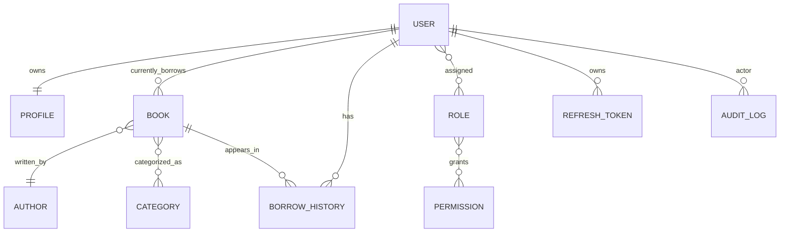

# Library Management System ER Diagram

## Relationship Requirements

- One-to-One: `users` to `profiles`
- One-to-Many: `users` to borrowed `books` through `books.current_borrower_id`
- Many-to-One: `books` to `authors`
- Many-to-Many: `books` to `categories`

Operational borrowing uses `borrow_history` so multiple copies of the same title can be borrowed while keeping accurate due dates, returns, and fines.
